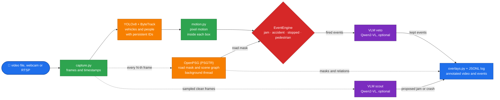
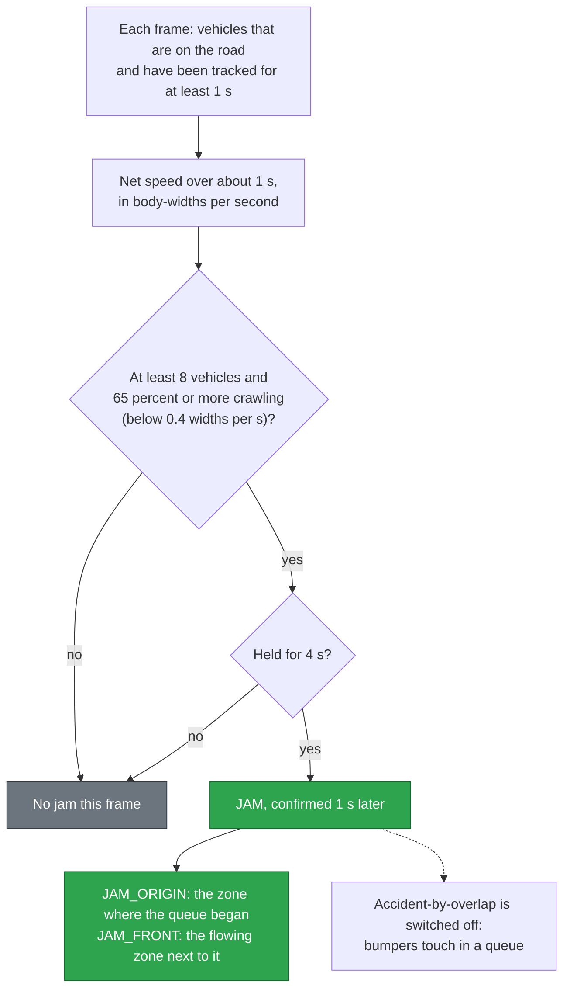
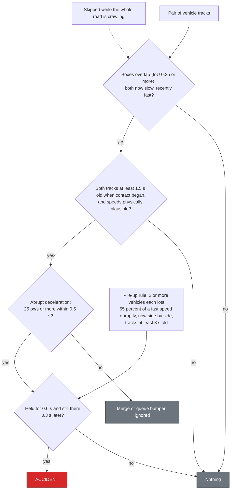
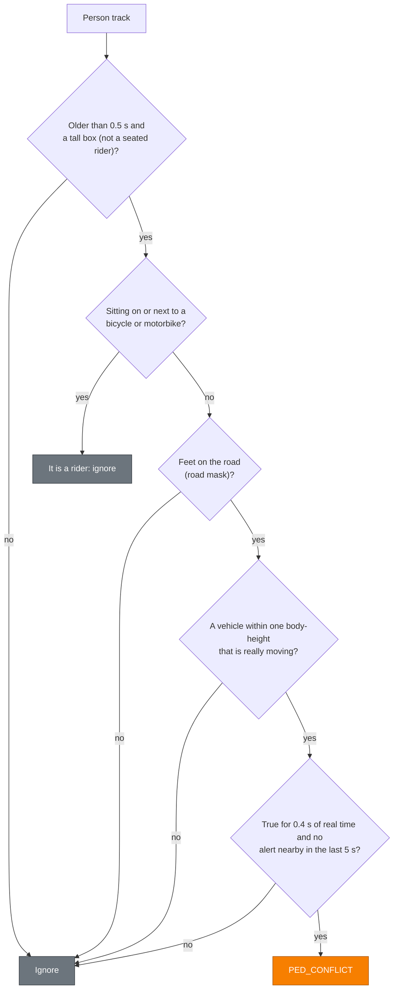
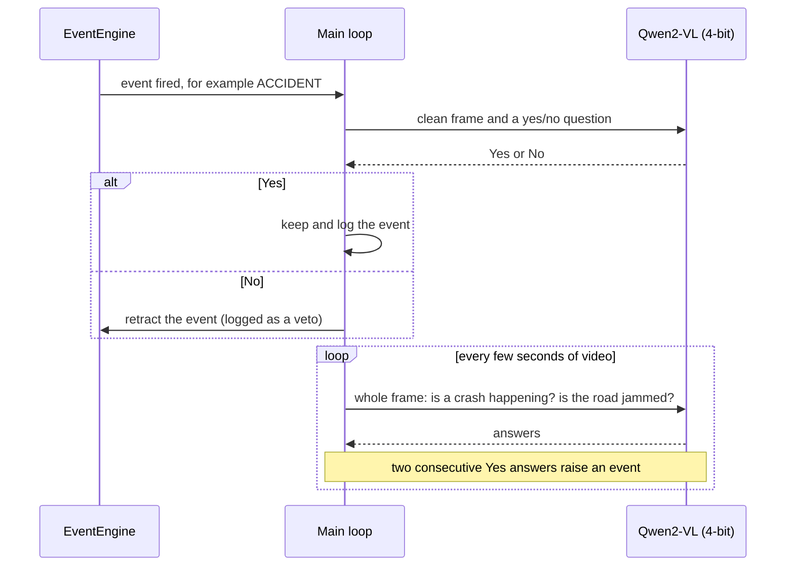

<div align="center">

# 🚦 Traffic-Monitor

### Watches traffic video and reports jams, crashes, stopped vehicles and pedestrian conflicts


</div>

> [!NOTE]
> **A research prototype, measured honestly.** On 23 held-out real clips it found **4 of 4 traffic jams** with no false
> alarms, but only **2 of 7 crashes**. The numbers, the method and every limitation are below.

> [!WARNING]
> Not a safety system. Accident detection is weak, moving-camera (dashcam) footage is mostly out of scope,
> and it runs at about 1 to 3 frames per second on a GTX 1650, so it is for **recorded video**, not live cameras.

Point it at a video file, a webcam or an RTSP stream and it writes back an **annotated video** and a
**machine-readable event log**: tracked vehicles with IDs and speeds, scene-graph masks and relations, congestion zones,
and traffic incidents (jam, jam origin, queue front, accident, stopped vehicle, pedestrian conflict).

## At a glance

| | |
|---|---|
| **Input** | video file, webcam index or `rtsp://` stream |
| **Output** | annotated `.mp4` + `events.jsonl` (every event carries the evidence that fired it) |
| **Detector / tracker** | YOLOv8 + ByteTrack (optionally a VisDrone fine-tune, see the notebooks) |
| **Scene understanding** | OpenPSG (PSGTR) panoptic scene graph, run on every N-th frame in a background thread |
| **Decisions** | a pure-Python rule engine: no GPU, no model, unit-tested on its own |
| **Second opinion** | optional Qwen2-VL (4-bit): vetoes doubtful events and can propose jams and crashes |
| **Hardware tested** | one GTX 1650 (4 GB), Windows, 7 GB RAM |
| **Evidence** | 58 unit tests, plus 51 real YouTube clips (28 development, 23 held-out) |

## Architecture



*Solid arrows run on every frame; dotted arrows are periodic or optional. The decision layer never touches a model:
it only sees tracked boxes, speeds and (when available) the road mask.*

---

## Contents

- [Quickstart](#quickstart)
- [Results on real footage](#results-on-real-footage)
- [How it works](#how-it-works)
- [What it detects](#what-it-detects)
- [How each decision is made](#how-each-decision-is-made)
- [The optional VLM layer](#the-optional-vlm-layer)
- [Earlier verified runs](#earlier-verified-runs)
- [CLI reference](#cli-reference)
- [Repository layout](#repository-layout)
- [Environment](#environment)
- [Testing](#testing)
- [Evaluation](#evaluation)
- [Decision log: why the engine is being reworked](#decision-log-why-the-engine-is-being-reworked)
- [Fine-tuning notebooks and models](#fine-tuning-notebooks-and-models)
- [Lessons learned](#lessons-learned)
- [Known limitations](#known-limitations)
- [Roadmap](#roadmap)
- [Glossary](#glossary)
- [Credits](#credits)
- [License](#license)

---

## Quickstart

```bash
git clone --recurse-submodules https://github.com/Dadhichi-Sarker-Shayon/Traffic-Monitor.git
cd Traffic-Monitor/realtime-video-tracking

# your own footage / camera / IP cam
python -m traffic_watch --source my_road.mp4 --out outputs/my_road.mp4
python -m traffic_watch --source 0 --show              # webcam, live window
python -m traffic_watch --source rtsp://... --show     # IP camera
```

Outputs land next to each other: annotated `*.mp4` + `<name>.events.jsonl`
(one JSON object per event and per analyzed scene-graph frame — `t`, `frame`,
`type`, `detail`, `zone`, `track_ids`).

Try it without any footage of your own — a synthetic 40s clip with a crash at
4s, a jam, a pedestrian crossing and a stalled vehicle:

```bash
python tools/make_demo_video.py
python -m traffic_watch --source sample_media/clips/demo_traffic.mp4 \
    --detections sample_media/clips/demo_gt.jsonl --no-psg --out outputs/demo_nopsg.mp4
```

## Results on real footage

Scored on **23 held-out YouTube clips** that were labelled *before* the system was run on them and never used for
tuning (28 other clips were used for development). Method, labels and raw outputs:
[`realtime-video-tracking/eval/real/REPORT.md`](realtime-video-tracking/eval/real/REPORT.md).

| event | rules only | + VLM veto | + VLM veto + VLM scout |
|---|---|---|---|
| `JAM` | P 0.67 · R 0.50 | P 1.00 · R 0.50 | **P 1.00 · R 1.00** (4 of 4 jams, no false alarm) |
| `ACCIDENT` | P 0.40 · R 0.29 | P 1.00 · R 0.14 | P 0.67 · R 0.29 (2 of 7 crashes) |
| `STOPPED` | 3 false alarms, none correct | same | same |
| `PED_CONFLICT` | 1 of 1, no false alarm | same | same |

*P = precision, R = recall, counted per clip.* Read it honestly:

- **Jam detection works** on recorded footage from a fixed camera.
- **Accident detection does not yet**: 2 of 7 crashes were found, and the VLM veto trades missed crashes for fewer
  false alarms. It is weakest on dashcam, cab-view and low-speed contact.
- `STOPPED` fires on parked cars and cars waiting at lights when the OpenPSG road mask is not used (these runs did not use it).
- **Small sample** (7 crash clips, 4 jam clips, 1 pedestrian clip): indicative, not precise. About 1-3 fps on a GTX 1650,
  so this is for offline analysis, not live cameras.

## How it works

1. **Capture.** `capture.py` reads a file, camera or RTSP stream and stamps every frame with a time. Files use the media
   timestamps (so results do not depend on how fast your machine is); live streams use the wall clock and reconnect if the
   stream drops.
2. **Detect and track.** YOLOv8 finds vehicles and people; ByteTrack gives each one an ID that survives short occlusions
   (a long track buffer and strict re-association keep one car from collecting dozens of IDs).
3. **Measure motion properly.** Speed is *not* just how far a box centre moved: detector jitter makes a parked car's box
   wobble. The engine combines the pixel change inside the box (`motion.py`) with the **net displacement over about one
   second, measured in body-widths per second**, so the same threshold means the same thing at 720p and 4K, close and far.
4. **Understand the road.** OpenPSG runs in a background thread every N frames and produces a road mask plus a scene graph
   (`car -[driving on]-> road`). Vehicles that are not on the road (car parks, pavements) are not counted towards congestion.
5. **Decide.** The `EventEngine` turns tracks over time into events. Every rule uses hysteresis (separate on/off
   thresholds), a persistence requirement, and a short **confirmation window**: a candidate is only reported if it is still
   true a moment later, and is withdrawn silently if the evidence falls apart.
6. **Double-check (optional).** A vision-language model looks at the actual pixels of each fired event and can veto it, and
   can also scan sampled frames for jams and crashes.
7. **Write results.** Everything is drawn onto the output video, and each event is logged with an `evidence` dictionary
   (IoU, speed drop, track ages, ...) so you can see *why* it fired.

## What it detects

Every rule uses hysteresis (on/off thresholds), a persistence requirement, and
a **retrospective confirmation window**: a candidate is not reported the moment
its score crosses the threshold, it has to still be there a moment later, and it
is retracted silently if the evidence falls apart before then. That last part is
what lets the system use *future* frames, which no amount of past-frame evidence
can replace. Set `--confirm-jam 0 --confirm-accident 0` for the old
fire-immediately behaviour.

| event | rule | confirmed after |
|---|---|---|
| `JAM` | ≥8 on-road vehicles of which ≥65% are *crawling* (< 0.4 body-widths/s of **net** displacement over ~1 s; jitter-proof and size-independent; four-wheelers decide when there are enough, since motorbikes filter through queues), held ≥4 s. The older per-zone rule (≥3 vehicles, median speed under threshold) still applies | 1.0 s |
| `JAM_ORIGIN` | jammed zone whose onset is clearly earliest → where the queue started | 1.0 s |
| `JAM_FRONT` | adjacent zone still flowing → the head of the queue | 1.0 s |
| `ACCIDENT` | (a) two *established* tracks (≥1.5 s old when contact began) overlapping after fast motion with an abrupt deceleration, held ≥0.6 s; or (b) a pile-up: ≥2 vehicles that each lost ≥65% of a recent fast speed abruptly and now stand side by side (tracks ≥3 s old). Raw speeds above 25 body-widths/s (a track ID jumping between cars) are rejected, and overlap detection is suspended while the whole road is crawling | 0.3 s |
| `STOPPED` | vehicle stationary ≥8 s in an *active* flow — suppressed inside jams and nose-to-tail queues | — |
| `PED_CONFLICT` | a tall person track ≥0.5 s old, *on the road* (OpenPSG road mask), within one body-height of a vehicle that is really moving, for ≥0.4 s of real time; riders on bikes and motorbikes are excluded; one alert per pedestrian cluster | — |
| *VLM scout* (optional, `--vlm-scout`) | every few seconds a vision-language model looks at a clean whole frame and is asked if a crash is happening / the road is jammed; two consecutive "yes" answers raise the event | — |

Three things make "cars standing still on the road" mean what it says:

- **Motion, not displacement.** Speed is cleaned up with the mean pixel
  difference inside the vehicle's own box (`traffic_watch/motion.py`), so a
  parked car whose box jitters counts as standing still, and a car driving
  *towards* the camera is not mistaken for a stopped one.
- **On the road, actually.** When OpenPSG reports a road region, vehicles whose
  boxes are not on it are not counted, so cars in a side street or on a pavement
  no longer inflate congestion. Before the first scene-graph result arrives
  there is no mask and no constraint.
- **A scale-free threshold.** The default 18 px/s means different things at
  720p and 4K, wide-angle and telephoto, 30 m and 80 m up.
  `--jam-speed-mode auto` scales it to the traffic speed actually seen in the
  clip, and `metric` takes it in m/s once `--px-per-meter` is given.

Scene-graph relations from PSGTR (`driving on`, `parked on`, `crossing`, …) are
logged next to the events as `kind:"psg"` rows, so the semantic layer is
inspectable even when no incident fires.

The persistence requirement on `ACCIDENT` is not cosmetic. In dense traffic
seen from above, neighbouring cars overlap for a frame or two constantly —
detector box jitter, tracker ID swaps — and firing on the first overlapping
frame produced two phantom accidents on the aerial clip. Requiring the overlap
to hold removed both.

## How each decision is made

### Jam



If at least four cars are present, only cars vote: motorbikes filter through queues at speed and would hide a jam.

### Accident



Overlap alone is not a crash: two cars parking side by side, a tracker ID swap, or a perspective overlap of two distant
cars all look the same in a single frame. That is why the rule asks for a sudden speed drop, established tracks and a
sustained overlap.

### Pedestrian conflict



### Stopped vehicle

A vehicle that stays still for 8 s while the rest of the road is flowing. It is suppressed inside jams and nose-to-tail
queues. Without the OpenPSG road mask it also fires on kerbside parked cars (a known weakness, see the limitations).

## The optional VLM layer



- The model always sees the **clean** frame, never one covered in overlays. Crash and jam questions use the whole frame
  (a tight crop of two distant cars hides the road and the wreckage); pedestrian and stopped-vehicle questions use a crop.
- It runs as a **separate process** when needed, because OpenPSG pins an old torch while Qwen2-VL needs a modern one.
- If the model is missing or answers something unparseable, the event passes through unchanged: the VLM can only *remove*
  an alert it was shown, and the scout is the only place it can create one.
- Measured effect on held-out clips: the scout lifted jam recall from 2 of 4 to 4 of 4; the veto removed false alarms but
  also one real crash. A QLoRA fine-tune of the VLM made it *worse* and was dropped (see below).

## Earlier verified runs

These runs were made **before the rule rework** described under *Results on real footage*; the videos in
`realtime-video-tracking/outputs/` were not regenerated, so event counts will differ from a fresh run.
Measured on an NVIDIA GTX 1650 (4 GB).

| clip | frames | result |
|---|---|---|
| `accident_intersection.mp4` — busy junction, real crash | 833 | 9 events: accident (IoU 0.89 @1.5s), 3× jam each with its origin, queue front, stopped vehicle @15.5s; 32 scene-graph frames |
| `tiltshift_traffic.mp4` — high-angle, 7–12 vehicles/frame | 1770 | 70 scene-graph frames, **0 events** — traffic keeps flowing, so there is nothing to report. 2.7 fps |
| `demo_traffic.mp4` — synthetic, known ground truth | 40s | accident @4.7s (IoU 0.41), jam + origin @9.9s, pedestrian conflict @27s, no false positives |
| `accident_street.mp4` — street level, sparse traffic | 721 | 25 scene-graph frames, 0 events — only 0.6 vehicles/frame, below the density the jam and collision rules need |
| `aerial_traffic.mp4` — true top-down drone | 1452 | 56 scene-graph frames, **0 vehicles tracked** — the annotated output shows the empty result |
| `drone_traffic.mp4` — very high altitude | 375 | 12 scene-graph frames, **0 vehicles tracked** |

Every clip in `sample_media/clips/` has a matching annotated video and event log
in `outputs/`, so each claim above can be checked without re-running anything.
The two aerial outputs are worth watching specifically: they are the visual
counterpart to the limitation below — the overlays render, the HUD and zones
draw, and not a single track box appears.

Sample scene graph from the high-angle run:

```
car   -[driving on]-> road  0.91      car     -[beside]->     car      0.84
car   -[parked on]-> road  0.85      person  -[carrying]->   backpack 0.82
bus   -[driving on]-> road  0.90      person  -[walking on]-> road     0.89
```

The annotated videos and their event logs are checked in under
`realtime-video-tracking/outputs/` so every claim above can be verified without
re-running anything.

## CLI reference

| flag | default | meaning |
|---|---|---|
| `--source` | *required* | video file, camera index, or `rtsp://` URL |
| `--out` | – | annotated output video |
| `--log` | alongside `--out` | JSONL event log |
| `--detections` | – | ground-truth JSONL, skips YOLO (deterministic runs) |
| `--weights` | `yolov8s.pt` | YOLO weights (class ids must follow COCO; see the fine-tuned model below) |
| `--conf` / `--iou` | 0.55 / 0.6 | YOLO confidence / NMS IoU |
| `--imgsz` | 640 | YOLO input size; raise to 960-1280 for tall or high-resolution footage |
| `--device` / `--psg-device` | `cuda:0` / same | inference device; `--psg-device cpu` keeps OpenPSG off a small GPU |
| `--no-psg` | off | disable the OpenPSG scene-graph layer |
| `--psg-interval N` | 30 | run OpenPSG every N frames (`0` = off) |
| `--psg-rel-thresh` / `--psg-classes` | 0.55 / traffic set | scene-graph relation score floor / classes kept |
| `--max-frames N` | – | stop after N frames |
| `--grid-cols` / `--grid-rows` | 6 / 3 | congestion zone grid |
| `--jam-speed-mode` | `auto` | `abs` fixed px/s · `auto` relative to this clip · `metric` m/s via `--px-per-meter` |
| `--confirm-jam` / `--confirm-accident` | 1.0 / 0.3 | seconds a candidate must survive before it is reported |
| `--collision-dv` | 25 | px/s speed drop a collision overlap must show |
| `--vlm` | off | have a VLM check every fired event (can veto, never invents) |
| `--vlm-scout` / `--vlm-scout-interval` | off / 4 | let the VLM propose jams/crashes from sampled whole frames |
| `--vlm-model` / `--vlm-python` / `--vlm-adapter` | Qwen2-VL-2B / – / – | VLM id; python of an env that has `transformers` (runs it as a worker process); optional LoRA adapter |
| `--no-road-mask` | off | ignore the OpenPSG road region when counting vehicles |
| `--px-per-meter` | – | calibration: report km/h instead of px/s |
| `--show` | off | live preview window |

## Repository layout

```
realtime-video-tracking/
  traffic_watch/
    capture.py        file | webcam | rtsp source abstraction
    detector.py       YOLOv8 + ByteTrack wrapper (COCO vehicles/persons)
    tracker.yaml      ByteTrack settings (long buffer, strict re-association)
    psg.py            OpenPSG PSGTR adapter (mmdet 2.x) + threaded runner
    events.py         EventEngine — all decision heuristics (pure, tested)
    adjudicator.py    optional VLM: veto fired events + the "scout"
    vlm_backend.py    Qwen2-VL (4-bit) in-process or as a worker process
    motion.py         pixel-motion signal inside each vehicle box
    overlays.py       zones, masks, relation edges, tracks, event banners
    __main__.py       CLI
  tests/              58 unit tests (event engine, VLM adjudicator, live pipeline)
  tools/
    eval_real/        scripts that produced the real-footage evaluation
    ...               demo-clip generator, labelling loop, YOLO / OpenPSG smoke tests
  eval/
    real/             labels, raw results and REPORT.md of the real-footage evaluation
  notebooks/          three Kaggle fine-tuning notebooks (YOLO, VLM QLoRA, fast classifier)
  weights/            (git-ignored) fine-tuned weights go here
  sample_media/       source clips
  outputs/            annotated videos + event logs from earlier runs
third_party/
  openpsg/            OpenPSG (git submodule, pinned to 34b2a89)
```

## Environment

Verified on Python 3.10 with two virtualenvs on a local disk (the project
itself lives on a synced drive, where virtualenvs do not work):

| env | contents |
|---|---|
| `openpsg1x` | torch 1.13.1+cu117, torchvision 0.14.1, mmcv_full 1.7.1, mmdet 2.28.2, ultralytics 8.4.171, opencv-python |
| `openpsg-env` | torch 2.1.2+cu121 sandbox, used for the unit tests |

Model weights are not committed. Fetch the PSGTR checkpoint into
`third_party/openpsg/work_dirs/checkpoints/epoch_60.pth` from the official
OpenPSG model zoo; the expected SHA256 is
`1c4ddcbda74686568b7e6b8145f7f33030407e27e390c37c23206f95c51829ed`.

Throughput is dominated by OpenPSG: roughly 1.3–2.8 s per analyzed frame on a
GTX 1650, so `--psg-interval` is the main knob between latency and cost.

## Testing

```bash
cd realtime-video-tracking
pip install -r requirements.txt pytest
python -m pytest tests -q --ignore=tests/test_psg.py      # 58 passed, no GPU or model needed
```

The suite feeds synthetic detection sequences into the event engine — jams that form versus flow, hysteresis
clearing, transient overlaps, pile-ups, pedestrians versus riders — and fake models into the VLM layer, so it runs
without a GPU. `tests/test_psg.py` needs the OpenPSG (mmdet) environment.

## Evaluation

Unit tests prove the rules behave as coded. They cannot tell you whether the
rules are *right*, so there is a second, measurement-based loop over real
footage. It needs no GPU: the engine's answers are already in the JSONL logs.

```bash
python tools/make_eval_set.py     # 1. carve 6s windows + contact sheets out of the clips
python tools/label_eval.py        # 2. label them (keyboard-only GUI, stays local)
python tools/score_eval.py --report eval/report.md   # 3. precision/recall per rule
```

`make_eval_set.py` picks windows on purpose: one centred on every event the
engine fired (these measure precision) plus evenly spaced ones elsewhere (these
measure recall). Windows from the synthetic demo clip are auto-labelled from the
constants in `tools/make_demo_video.py`, so human effort goes only to real
footage.

The scorer treats the two rule families differently, because they are different
kinds of thing: `ACCIDENT` is an **instant** (did it fire inside the window),
while `JAM` is a **state** (was it active during the window — reconstructed from
the log's transitions). Real footage and the synthetic clip are scored in
separate cohorts so flat graphics never flatter the numbers.

### Real-footage evaluation

`eval/real/` holds the labels for 51 YouTube clips (28 development, 23 held-out), the raw outputs and
[`REPORT.md`](realtime-video-tracking/eval/real/REPORT.md). Footage is not redistributed; the YouTube ids are in
[`eval/real/clip_sources.json`](realtime-video-tracking/eval/real/clip_sources.json) so the clips can be fetched again. Scripts: `tools/eval_real/` (they contain the
paths of the machine they were written on; edit the constants at the top). Labels are one person's, made from frame
contact sheets — subjective, with clips marked *uncertain* excluded.

## Decision log: why the engine is being reworked

The current rules were found to be wrong on real footage, and the useful part
is knowing *why*, because it rules out the obvious fix:

- `ACCIDENT` is decided by box overlap plus speed history. Geometry cannot tell
  a crash from two cars parking side by side, from a tracker ID swap, or from
  cars passing on a narrow road. There is no notion of *visible damage* anywhere
  in the code.
- `JAM` measures centroid displacement in raw pixels per second and thresholds
  it at 18 px/s. That is blind to scale: the same number means different things
  at 720p and 4K, wide-angle and telephoto, 30 m and 80 m up. A car driving
  *towards* the camera barely moves in the image and reads as stopped. It is
  also not motion, only displacement, so detector jitter on a stationary car
  looks like movement.
- The event engine never sees the PSG road mask, so "cars standing on the road"
  also counts parked cars, cars in a lot and cars on a pavement, and the fixed
  6×3 frame grid cuts across roads whatever direction they run.
- The engine is strictly causal: it fires from past frames only and can never
  use the next second to confirm or retract. *(Fixed — see the retrospective
  confirmation window above.)*

Fine-tuning the detector fixes none of these. The order taken is therefore:
measure first (the eval loop), then the `JAM` rework and the retrospective
confirmation window, then a VLM verification stage run locally on a 4 GB card.
**Update:** the zero-shot VLM turned out useful (it finds jams and removes many false alarms), while a QLoRA
fine-tune of it on public crash datasets made it *worse* on a held-out set (AUC 0.755 → 0.650) and was dropped.

Confirmation has a real cost: on the synthetic clip the crash is now reported at
6.9s instead of 4.7s, because it waits for the overlap to persist 0.6s and then
still be there 1.5s later. That is the intended trade — a decision that survives
contact with the next two seconds — but it is a trade, and `--confirm-* 0` gets
the old timing back.

## Fine-tuning notebooks and models

`realtime-video-tracking/notebooks/` has three self-contained Kaggle notebooks; see its README for what was and was not tested.

| notebook | result |
|---|---|
| `01_yolo_finetune_traffic` | YOLOv8s on VisDrone, classes remapped to the COCO ids this project uses. mAP50 0.26 → 0.55 on VisDrone's validation set (drone footage). Roughly twice as many vehicles found on elevated and fixed cameras in a small spot check, **fewer on a dashcam clip** — compare on your own footage before switching. The weights are **not published**; run the notebook to reproduce them. |
| `02_vlm_crash_qlora` | adapter did **not** help (held-out AUC 0.755 → 0.650); not used. Kept for the method. |
| `03_crash_classifier_fast` | written and tested on fake data only; **not run on real data**. |

After running notebook 01, try the fine-tuned detector: `python -m traffic_watch --source clip.mp4 --weights weights/yolov8s_traffic_best.pt --imgsz 960`.

## Known limitations

- **Accident detection is weak** (2 of 7 held-out crashes found). Dashcam / cab-view footage breaks the fixed-camera
  assumption (a crash is reported late or missed), and low-speed contact is not detected by design.
- **`STOPPED` over-fires on parked cars** unless the OpenPSG road mask is available.
- Evaluation is small (51 clips, 7 crashes) and the labels are one person's.
- **True top-down drone footage does not work with the stock detector.** The COCO-trained detector
  cannot see cars from directly overhead; this is a domain gap, not a tuning
  problem. Measured on `sample_media/clips/aerial_traffic.mp4` (1452 frames):
  at conf 0.35 / imgsz 640 there are zero vehicles on every sampled frame, and
  at conf 0.05 / imgsz 1280 only junk labels (`suitcase`, `cell phone`,
  `boat`, `airplane`). `drone_traffic.mp4` is higher altitude still. Fixing
  this needs aerial-trained weights (DOTA / VisDrone) or tiling plus rotation
  for small objects. A VisDrone-fine-tuned detector now exists (see above) but has **not been evaluated on these
  clips**. Both clips are kept in the repo so the finding stays reproducible.
- Events are geometric and heuristic. A collision is inferred from sustained
  overlap after fast motion, not from visual damage — it will not catch a crash
  where the vehicles separate cleanly, and dense parking can still look
  accident-like.
- The rules need traffic density to work on: a jam needs ≥3 vehicles in a zone
  and a collision needs two overlapping ones, so sparse scenes stay silent by
  design. `accident_street.mp4` is the example — a real street scene that the
  detector only finds 0.6 vehicles per frame in.
- Speeds are in pixels per second unless `--px-per-meter` calibration is given.
- The OpenPSG dependency chain (mmcv 1.x / mmdet 2.x / torch 1.13) is pinned to
  an older CUDA stack; newer GPUs need a rebuild of those wheels.

## Lessons learned

These came from measuring, not from guessing, and each one changed the code:

- **Measure before you tune.** The repository started with zero labelled real footage, so no rule change could be judged.
  Building the labelling and scoring loop first is what exposed that early "it works" results came from a handful of clips.
- **Displacement is not motion.** Detector jitter made parked cars look like they were moving at 50 px/s, and the same
  pixel threshold meant different things at 720p and 4K. Net displacement in body-widths per second fixed both.
- **Riders look like pedestrians.** Most early pedestrian alerts were people riding motorbikes (the detector reports the
  rider and the bike separately). Excluding anything on or next to a two-wheeler cut 19 alerts to 1 on one clip.
- **A track ID is not a vehicle.** The tracker gave one car dozens of IDs. Long buffers and strict matching helped, and the
  accident rule now only trusts tracks that were established when contact began and rejects physically impossible speeds.
- **Fine-tuning is not automatically better.** The YOLO fine-tune improved its own benchmark (mAP50 0.26 to 0.55), but
  the VLM fine-tune scored *worse* on held-out data. Public crash datasets turned out to be near-identical video frames,
  which made the first "improvement" a leak. A perceptual-hash check now removes near-copies before scoring.
- **Silent failures are the dangerous ones.** A path assumption wrote every training label as empty and a time option
  stretched training to fill the whole budget. Both ran without errors. The notebooks now count boxes before training and
  stop themselves on the clock instead.
- **Report what failed.** Accident recall is 2 of 7 and the README says so.

## Roadmap

- Re-score stopped vehicles and pedestrians **with OpenPSG on** (needs a machine with more RAM than the 7 GB used here).
- Label 30+ more real crash clips: the accident numbers currently rest on 7.
- Compare the fine-tuned YOLO against the stock model on the full evaluation, not just a spot check.
- Make the VLM veto less likely to remove real crashes (a second question, or two "no" answers).
- Ego-motion handling for moving cameras, and a proper low-speed-contact rule.

## Glossary

| term | meaning |
|---|---|
| **IoU** | intersection over union: how much two boxes overlap (0 none, 1 identical) |
| **ByteTrack** | the tracker that keeps an ID on each object from frame to frame |
| **Body-width per second** | speed measured in units of the vehicle's own width, so near and far objects compare fairly |
| **Hysteresis** | different thresholds for switching an event on and off, so it does not flicker |
| **Confirmation window** | a candidate event must still hold a moment later to be reported |
| **OpenPSG / PSGTR** | panoptic scene-graph model: masks plus relations such as "car driving on road" |
| **VLM** | vision-language model; here Qwen2-VL answers yes/no questions about an image |
| **QLoRA** | fine-tuning a 4-bit model through small adapter weights |
| **mAP50 / mAP50-95** | standard detector accuracy scores (higher is better) |
| **Held-out set** | clips labelled and scored once, never used to tune the rules |

## Credits

- **OpenPSG / PSGTR** — Zhou et al., *Panoptic Scene Graph Generation*, ECCV 2022.
  Submodule pinned to `Jingkang50/OpenPSG` @ `34b2a89`.
- **Ultralytics YOLO** and **ByteTrack** for detection and multi-object tracking.
- **Qwen2-VL** (Alibaba) for the optional vision-language layer.
- **VisDrone** — Du et al., *Detection and Tracking Meet Drones Challenge*, IEEE TPAMI 2022 (no licence file; research use).
- Public crash datasets used in the notebooks: `suryaprabhakaran2005/road-accidents-from-cctv-footages-dataset`, `ckay16/accident-detection-from-cctv-footage` (Kaggle).

## License

**No license has been chosen yet.** Note that this project depends on Ultralytics YOLO (AGPL-3.0) and that the fine-tuned weights are derived from it, so AGPL-3.0 is the natural choice. Until a `LICENSE` file is added, all rights are reserved by the author.