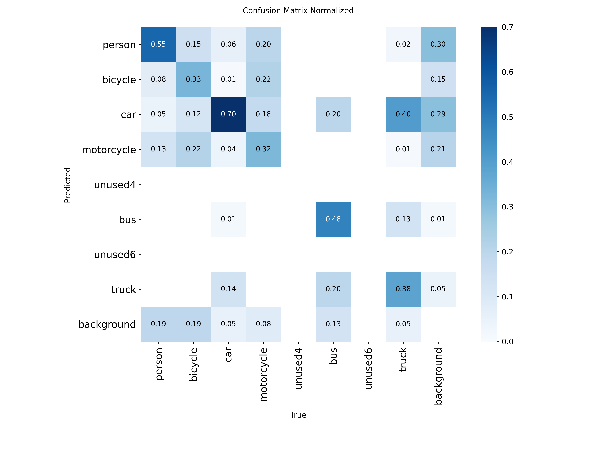

# YOLOv8s fine-tuned for elevated-camera traffic scenes (VisDrone)

A YOLOv8s detector fine-tuned on **VisDrone2019-DET** and remapped to six traffic classes. It is the optional
detector of the [Traffic-Monitor](https://github.com/Dadhichi-Sarker-Shayon/Traffic-Monitor) project, a pipeline that
reports jams, crashes, stopped vehicles and pedestrian conflicts from video.

**Short version:** much better than the stock COCO model on drone / elevated views of vehicles, but it learned from
drone footage, so **check it on your own footage** — on one dashcam clip it found *fewer* vehicles than the stock model.

## Classes

The classes keep the **COCO ids**, so the model is a drop-in replacement wherever `yolov8s.pt` is used with a class filter:

| id | class | built from (VisDrone) |
|---|---|---|
| 0 | person | pedestrian, people |
| 1 | bicycle | bicycle |
| 2 | car | car, van, tricycle, awning-tricycle |
| 3 | motorcycle | motor |
| 5 | bus | bus |
| 7 | truck | truck |

Ids 4 and 6 (`unused4`, `unused6`) exist only to keep the other ids aligned with COCO and are never predicted.

## Results

Evaluated on VisDrone2019-DET **validation** (548 images, 38,759 boxes), imgsz 960. The same split was used to pick the
best epoch, so these numbers are slightly optimistic; **no test-dev evaluation was run**.

| model | mAP50 | mAP50-95 |
|---|---|---|
| stock YOLOv8s (COCO), same classes | 0.258 | 0.151 |
| **this model** | **0.553** | **0.333** |

Per class, mAP50-95: car 0.598 · bus 0.462 · truck 0.310 · motorcycle 0.259 · person 0.256 · bicycle 0.113.



The matrix is computed at Ultralytics' validation confidence of 0.001, which inflates cross-class confusion and the
"background" column. It still shows the real weak spots: **motorcycles, bicycles and people are mixed up with each other**
(only about a third of motorcycles and bicycles are labelled correctly) and 40% of trucks are called cars.

### Training log

Validation metrics during training (VisDrone validation set, full per-epoch log in [`training/results.csv`](training/results.csv)):

| epoch | mAP50 | mAP50-95 | precision | recall |
|---|---|---|---|---|
| 1 | 0.376 | 0.209 | 0.503 | 0.375 |
| 5 | 0.451 | 0.258 | 0.593 | 0.418 |
| 10 | 0.484 | 0.281 | 0.566 | 0.463 |
| 15 | 0.517 | 0.305 | 0.615 | 0.488 |
| 20 | 0.538 | 0.319 | 0.653 | 0.498 |
| 26 | 0.560 | 0.335 | 0.662 | 0.511 |
| 30 | 0.557 | 0.333 | 0.662 | 0.507 |

Improvement was steady and had flattened by epoch 25-26; Ultralytics keeps the best epoch (26 by mAP50-95) as the
shipped weights. The final re-validation above (0.553 / 0.333) differs slightly from the in-training log because it
re-runs validation with the maximum detections raised to match the densest image (up to 902 objects).

## Demo videos

`demos/` has an annotated demo of the Traffic-Monitor pipeline on a scripted synthetic scene, with its event log. **It was made with the stock YOLOv8s detector, not with these weights**, and shows the decision rules rather than
this model. Details and caveats: [`demos/README.md`](demos/README.md).

## Limitations — please read

- **Domain:** trained only on drone footage. In a small spot check on 24 frames, it found about twice as many vehicles
  as the stock model on elevated or fixed cameras, but fewer on a dashcam clip (1.8 vs 5.2 per frame). Detection counts
  are not accuracy; that was not measured on real traffic-camera footage.
- Weak on bicycles, trucks, buses and riders (see above). Class merges (pedestrian + people, car + van) lose information.
- Small objects at low resolution are still missed; training and evaluation used imgsz 960.
- Not intended for safety-critical use.

## Usage

```python
from ultralytics import YOLO
model = YOLO("yolov8s_traffic_best.pt")
results = model.predict("road.jpg", imgsz=960, conf=0.4, classes=[0, 1, 2, 3, 5, 7])
```

With the Traffic-Monitor pipeline:

```bash
python -m traffic_watch --source clip.mp4 --weights yolov8s_traffic_best.pt --imgsz 960
```

## Training

Base `yolov8s.pt`; 30 epochs, imgsz 960, batch 8, AdamW (Ultralytics `auto`), cosine LR, mosaic off for the last 3 epochs,
AMP, one Tesla T4 (1.75 h), Ultralytics 8.4.171. Training set: VisDrone2019-DET train (6,471 images, 343,205 boxes after
remapping). Reproduce with `notebooks/01_yolo_finetune_traffic.ipynb` in the GitHub repository.

## License and data

- **Weights: AGPL-3.0**, inherited from Ultralytics YOLOv8.
- **Training data: VisDrone** (Tianjin University, AISKYEYE). It ships without a licence file and is intended for
  research use; check its terms before any commercial use. Cite: *Du et al., "Detection and Tracking Meet Drones
  Challenge", IEEE TPAMI 2022.*

## Files in this repository

| file | what |
|---|---|
| `yolov8s_traffic_best.pt` | the fine-tuned weights |
| `training/args.yaml` | the exact training hyperparameters (paths are those of the Kaggle machine) |
| `training/data.yaml` | the class mapping used for training |
| `training/results.csv` | per-epoch losses and validation metrics |
| `training/curves/` | F1, precision and recall curves against confidence |
| `training/samples/` | validation images with the true boxes (`*_labels`) and this model's predictions (`*_pred`) |
| `training/labels.jpg` | distribution of the remapped training labels |
| `demos/` | an annotated pipeline demo (synthetic scene) made with the stock detector, plus its event log |
| `assets/` | confusion matrix, training curves, PR curve and results used on this page |
